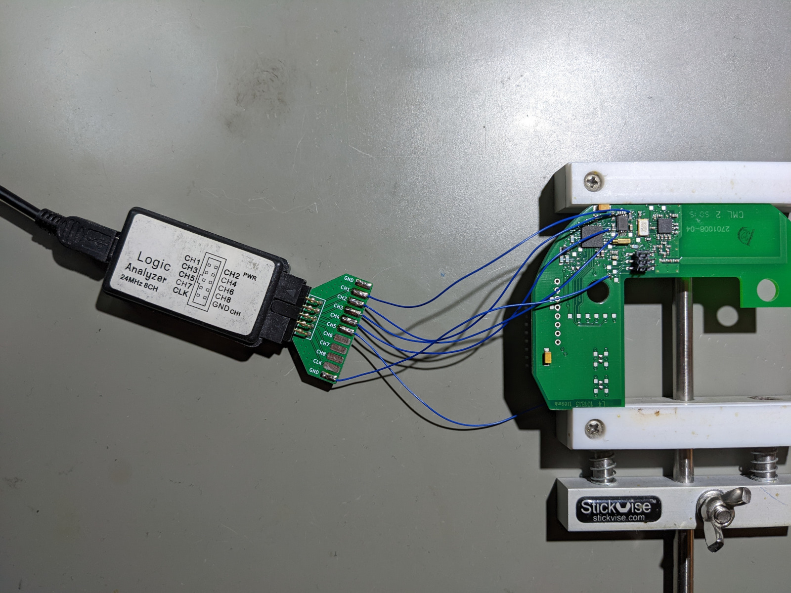

# logic-breakout

Solder-in adapter for cheap chinese logic analyzers follwing the quasi-standard
CH1-8 and GND pinouts. Simply solder Kynar wire to this board and your DUT.

Cheap enough to just have a bunch of and leave them attached to your DUTs,
which keeps the pin mapping clear and consistent while being able to freely
move the LA around.
