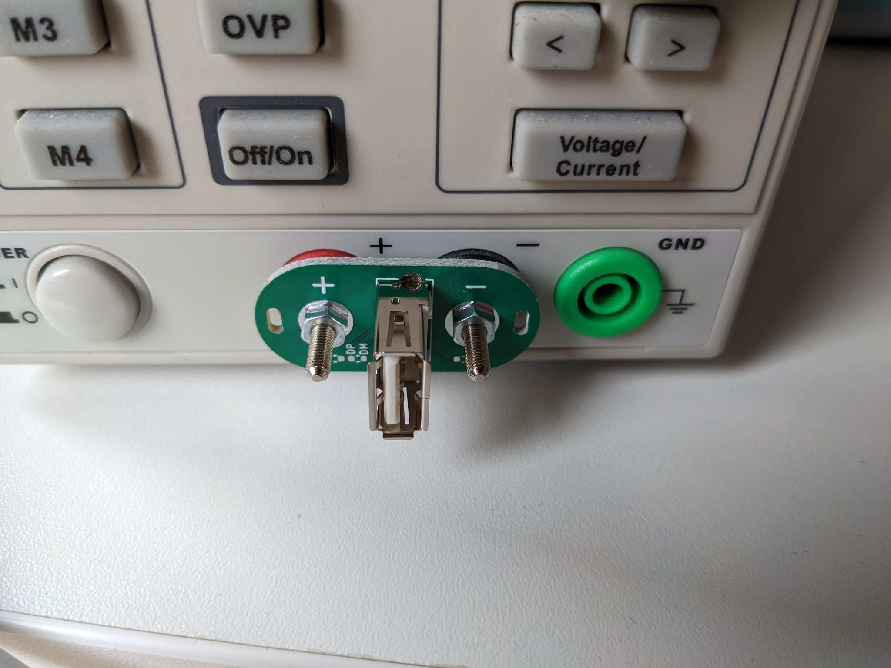

# supply2usb

A board for powering USB devices from a lab supply. Useful for testing new
devices with a current-limiting safety net. No more butchering USB cables!

Fits into standard 19mm/0.75" pitch 4mm sockets.

Additional features:
 * Has holes for adding ziptie loops to make unplugging easier.
 * The resistor options allow signalling various battery charging standards if
   desired.

BOM:
 * 2× Banana plug: Pomona Electronics 72918 (Digi-Key Part Number: 501-1200-ND)
 * 1× USB socket: Cvilux CU01SAV0S00 (Digi-Key Part Number: 2987-CU01SAV0S00-ND)
